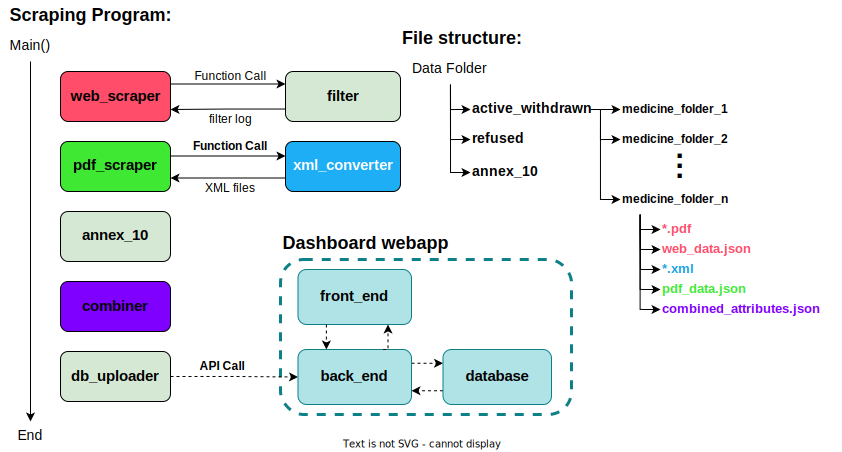

# Scraper and Dashboard to make data on regulation of medicines openly available

[Documentation can be viewed online here](https://mediseeuu.github.io/MediSeeUU/)

## How to install

Install python 3.10.7.
All the dependencies for the scraping modules are in the requirements.txt file in the scraping folder. Use `pip install -r requirements.txt` in the scraping folder to install these dependencies.

## How to use

### To test whole program:
Run the `__main__.py` in the scraping folder next to all the module folders.

### To test a module:
Comment out all the modules you don’t want to test in the `__main__.py` file.

## Functionality

The program delivered creates the discussed folder structure and fills it with pdf, xml and json files.

Currently the program has most of its functionality within the web scraper, filter, xml converter and pdf scraper modules. This means that all files up until pdf_data.json from the diagram below are made. 

Combiner is still a work in progress and will not create a json file containing useful information. The database communicator has functionality built in but will not communicate with the back-end since no useful data is being generated from the combiner module.

## Architecture Diagram

## Copyright statement

This program has been developed by students from the bachelor Computer Science at Utrecht University within the Software Project course.

© Copyright Utrecht University (Department of Information and Computing Sciences)
