# Backend User Manual

* [Development set-up](#devsetup)
* [Endpoints](#endpoints)
* [Admin panel](#adminpanel)
* [Adding variables](#addvariable)

<a name="devsetup"></a>

## Development set-up  

This setup guide is written with Ubuntu 20.04 in mind. Most of the steps will be the same for other operating systems.
There are a few prerequisites that we assume are already setup. These include:

* A Python3.10 install
* Access to a MySQL database

If the prerequisites are installed you can follow the guide below to get started.

In all the snippets below the current directory is `medctrl-backend/` unless specified otherwise.

### Install dependencies

0. Create and activate Python virtual environment.

    ```sh
    python3 -m virtualenv venv
    source venv/bin/activate
    ```

1. Install requirements.

    ```sh
    pip install -r requirements.txt
    ```

    During the installation of `mysqlclient` an error might occur because some libraries are not yet installed. These can be installed with the following command:

    ```sh
    sudo apt install python3-dev default-libmysqlclient-dev build-essential
    ```

<div style="page-break-after: always;"></div>

### Setup Configuration

The configuration files for the software should be placed in  `medctrl-backend/API/api_settings/settings/`. There already is a settings file (`common.py`) with general settings that are the same for every deployment.  
In addition to these settings you will need some extra configuration values, for example database login credentials. For development you should create a file named `dev_settings.py` in the `settings/` directory. \
Below is an example configuration which you can use as a template.

```py
# Import all common settings
from api_settings.settings.common import *

# Secret key that Django uses for generating hashes
SECRET_KEY = "random secret key"

# Whether to run Django in Debug mode
DEBUG = True

# Root path where the API will be listening on
BASE_URL = "api/"

# Database connnection settings
# The DB credentials can be hardcoded or loaded in 
# via environment variables 
DATABASES = {
    "default": {
        "ENGINE": "django.db.backends.mysql",
        "NAME": DB_NAME,
        "USER": DB_USERNAME,
        "PASSWORD": DB_PASSWORD,
        "HOST": DB_HOST,
        "PORT": DB_PORT,
    }
}

# Where to put static files for django. Not needed for development
STATIC_ROOT = "django-static"
```

<div style="page-break-after: always;"></div>

### MedCtrl Setup

1. Migrate database and create Django permission levels

```sh
# in directory medctrl-backend/API
python manage.py migrate
python manage.py create_column_permissions
```

2. Create a Django admin user and anonymous group.  
    To actually get data back, you need to assign permissions to this anonymous group. This can be done via the Django admin panel.  
    More details about permissions can be found in the 'Managing Groups' section of this manual.  

```sh
# in directory medctrl-backend/API
# this command will give some prompts for username and password
python manage.py createsuperuser
python manage.py init_setup
```

3. Run the backend

```sh
# in directory medctrl-backend/API
# Django will start on port 8000
python manage.py runserver 8000
```

<div style="page-break-after: always;"></div>

<a name="endpoints"></a>

## Endpoints

* GET `/medicine`\
This endpoint is used to retrieve the medicine data. A GET request to this endpoint will return all the data that the (anonymous) user has access to.

* GET `/procedure/{eunumber}`
This endpoint is used to retrieve all the procedures that are connected to the medicine with the given eunumber.

* `/saveselection` \
    This endpoint is used to create, retrieve and delete saved selections.

  * Creating a saved selection \
        POST `/saveselection` with following body:

        ```json
        {
            "name": "Name of selection",
            "eunumbers": [1, 2, 3] // list of selected medicines
        }
        ```

        ->

        ```json
        {
            "id": "12fb0250-a725-462d-8b06-92762194a2af", // id of the saved selection
            "name": "test",
            "created_at": "2022-06-15T11:11:59.466733Z",
            "created_by": "<username>",
            "eunumbers": [
                1,
                2,
                3
            ]
        }
        ```

<div style="page-break-after: always;"></div>

* Retrieving a single saved selection \
    GET `/saveselection/<selectionid>`\
    ->

    ```json
    {
        "id": "12fb0250-a725-462d-8b06-92762194a2af", // id of the saved selection
        "name": "test",
        "created_at": "2022-06-15T11:11:59.466733Z",
        "created_by": "<username>",
        "eunumbers": [
            1,
            2,
            3
        ]
    }
    ```

* Retrieving all saved selection for the current user \
    GET `/savedselection` \
    ->

    ```json
    [
        {
            "id": "12fb0250-a725-462d-8b06-92762194a2af", // id of the saved selection
            "name": "test",
            "created_at": "2022-06-15T11:11:59.466733Z",
            "created_by": "<username>",
            "eunumbers": [
                1,
                2,
                3
            ]
        }
    ]
    ```

* Deleting a saved selection \
    DELETE `/saveselection/<selectionid>`

<div style="page-break-after: always;"></div>

* GET `/detailedData` \
    This endpoint returns details about the types of variables that are in the database. This data is, among other things, used to determine how to filter/sort the medicine data.

* POST `/account/login`
    Used to login a user. POST with following body:

    ```json
    {
        "username": "username",
        "password": "password"
    }
    ```

    ->

    ```json
    {
        "expiry": "2022-06-15T21:11:51.454234Z",
        "token": "1c5cd1a9cacb2a883059d1b835378eee71adb3112f61cf38fb88252cbdcdd026",
        "user": {
            "id": 2,
            "username": "username",
            "groups": [
                {
                    "name": "group1",
                    "id": 1
                }
            ], // list of groups that the user is in
            "selections": [] // list of saved selection
        }
    }
    ```

* POST `/account/logout`, `/account/logoutAll` \
    These endpoints are used to logout the user. The `logoutAll` will end all active sessions of the given user.
    To logout, send a POST request with an empty body to one of these URLs.

<div style="page-break-after: always;"></div>

* POST `/scraper/medicine`
    This endpoint can be used to programatically (for example via the scraper) update the medicine data in de database.

    Updates can be done by sending a POST request with the following body\

    ```json
    {
        "override": true, // Whether to override manually updated values
        "data": [
            {
                "eunumber": 1,
                ...
            } // A list of medicine objects that will be updated
              // For a complete list of variables that can be updated
              // See the domain model
        ]
    }
    ```

* POST `/scraper/procedure`
    This endpoint can be used to programatically (for example via the scraper) update the procedure data in de database.

    Updates can be done by sending a POST request with the following body

    ```json
    {
        "override": true, // Whether to override manually updated values
        "data": [
            {
                "eunumber": 1, 
                "procedurecount": 1,
                ...
            } // A list of procedure objects that will be updated
              // For a complete list of variables that can be updated
              // See the domain model
        ]
    }
    ```

<div style="page-break-after: always;"></div>

<a name="adminpanel"></a>

## Admin panel

The Django admin panel is accessible via the `<ROOT_URL>/admin/` endpoint.

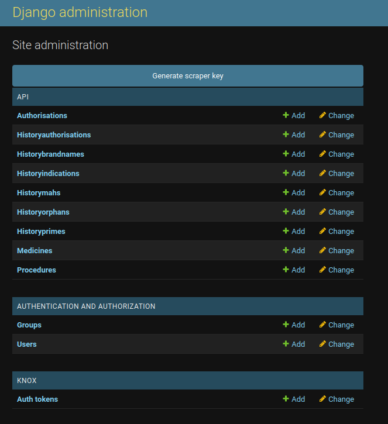

<div style="page-break-after: always;"></div>

### Importing data from existing Excel sheets

We have curated the initial dataset into Excel files that can be imported to the system. \
The data files can be found at `medctrl-backend/curated_data/`.
Clicking on a model in the Admin panel will show import and export options in the top-right:
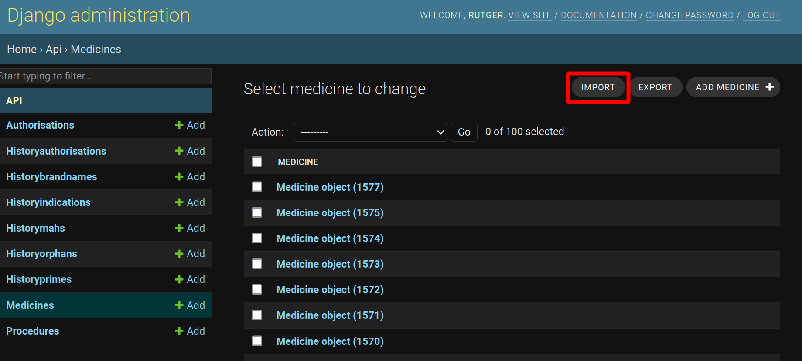

After submitting a file you will get an overview of the data that will be imported. You can then click confirm to actually import the data. \
Please note that importing the Procedures can take quite some time because it is a lot of data. (the 41k procedures took around 2-3 minutes to imoprt on a basic VM)

### Scraper API keys

In the admin panel you can generate an API key for the scraper. You can specify how many days the API key should be valid for and upon clicking generate you will be given the token which can be copied to the scraper.

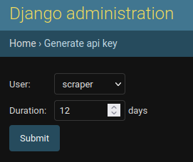
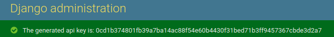
<div style="page-break-after: always;"></div>

### Manually update model values

It is possible to update individual objects values in the admin panel by following the links in the overview.

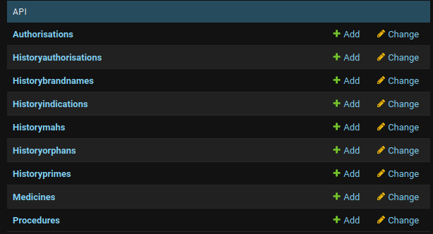

You will then be presented with an overview of all the objects that are in the database.

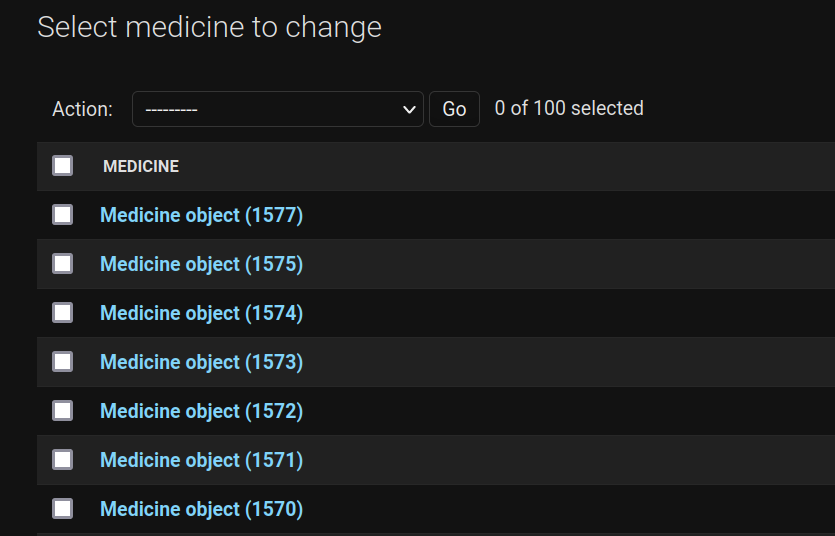

<div style="page-break-after: always;"></div>
Clicking on a medicine object will give options to edit or delete the object.

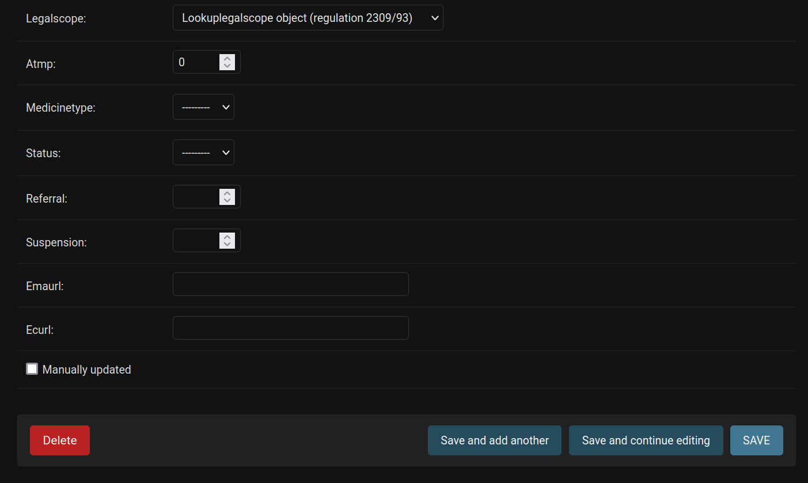

### Group management

We use groups to manage permissions. Groups can be managed via the admin panel.

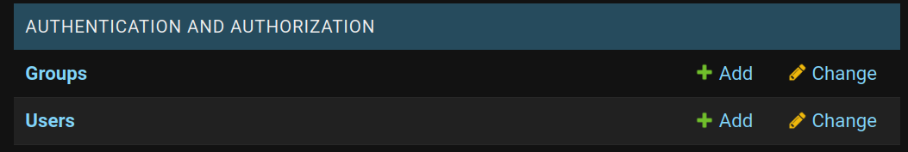

By default the initial setup script will create an anonymous group. If someone who is not logged in sends a request, the anonymous groups' permissions will be used to determine what data to send back. \
In the edit menu for a group you can specify which variables of a medicine a specific group has access to.

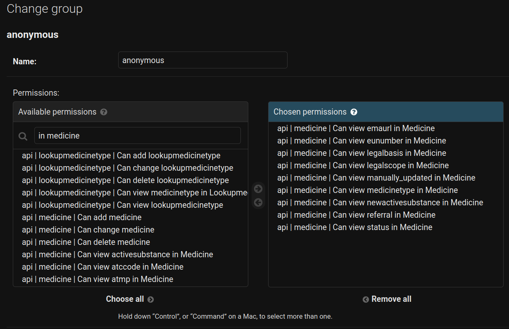

It is possible to create as many new groups as needed. On the users' page you can assign groups to users.

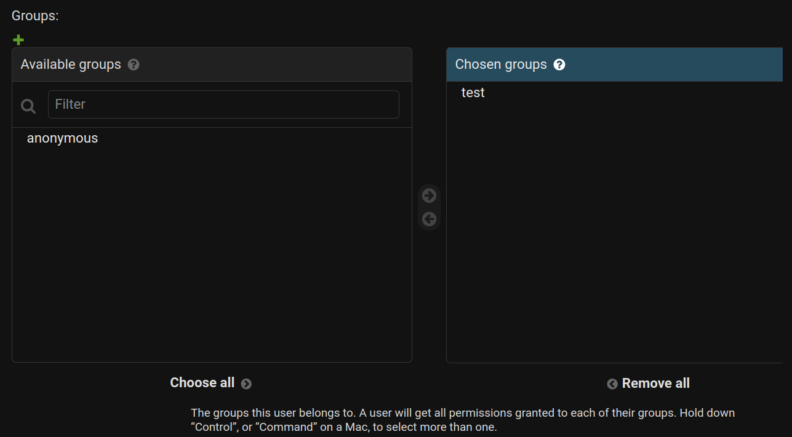

<div style="page-break-after: always;"></div>
It is also possible to assign permissions to individual users.

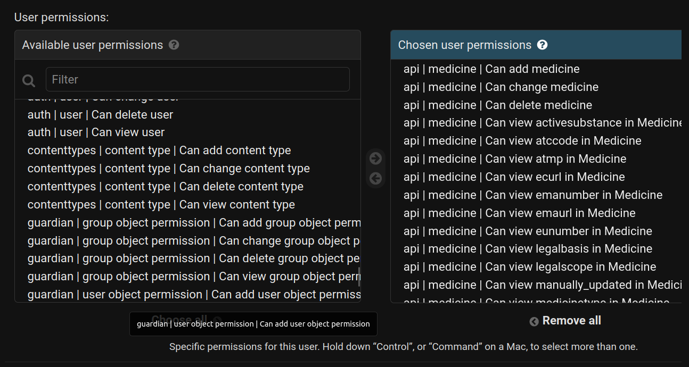

<a name="addvariable"></a>

## Adding variables

To add a new variable to the system there are a few things that need to be done:

* Add a new column to the appropriate model: \
    models are located in the `API/api/models/` folder.\
    To add a variable with name `X` to medicine for example you need to add a field `X` to the the `Medicine` model class in `medicine.py`.
    For more details on what types or relations are available please see the [Django documentation](https://docs.djangoproject.com/en/4.0/ref/models/fields/)

* Add an entry to `API/views/other/medicine_info_json.py` \
    In here you should specify what type the variable has and what the displayname should be. This is, among other things, used by the frontend to determine how to sort on this variable.
    An example entry would be:  

    ```json
    {
        "data-key": "X",
        "data-front-key": "X",
        "data-format": "string",
        "data-value": "Display name for frontend",
    }
    ```

* Create a new migration and migrate the database \
    Run the following commands to migrate the new changes:

    ```sh
    # in directory medctrl-backend/API
    python manage.py makemigrations
    python manage.py migrate
    python manage.py create_column_permissions
    ```

## User management

Normal users can be created in the Django admin panel.  
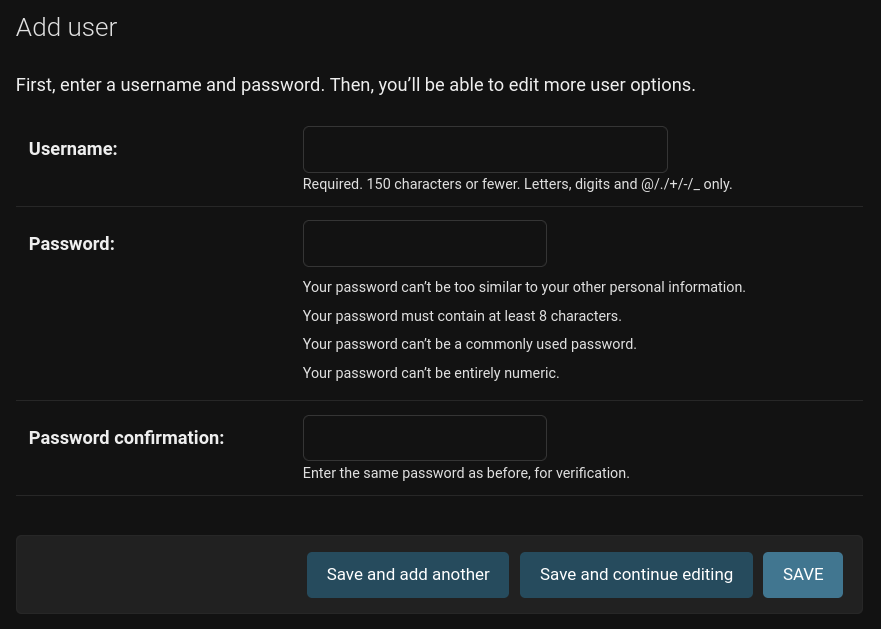

Once you have created a user you can assign groups and permissions to that user in the admin panel.  

The response of sending a login request (more details can be found in the 'Endpoints' section of this manual) contains a `token` key. This token is used to authenticate follwing requests.  
The token needs to be send in the `Authorization` header.  
The value of the headers should be: `Token <token>`, where `<token>` is the value that was returned with the login response.  
